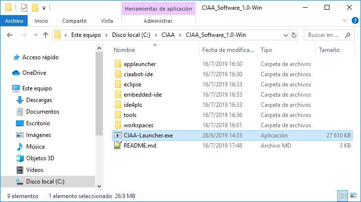
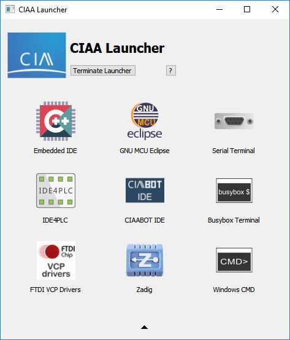
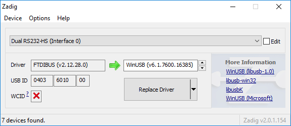
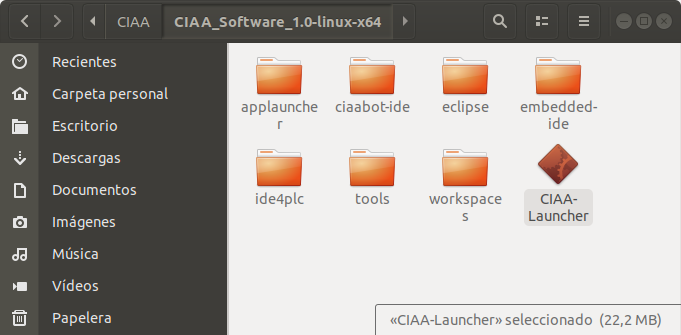
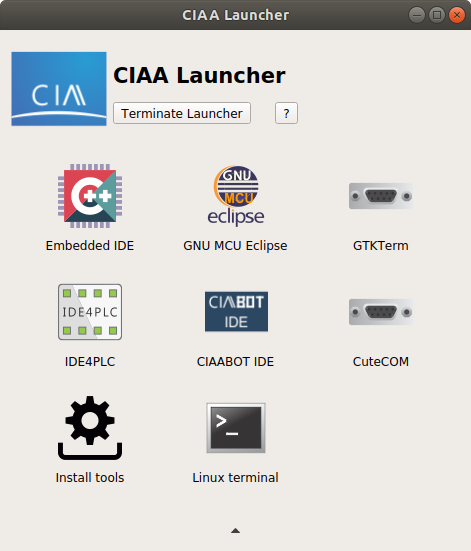

# Paquete de herramientas listas para usar para la programación de las plataformas del Proyecto CIAA

## Herramientas contenidas

- Lanzador de aplicaciones.
- Entornos de programación en lenguaje C/C++:
     - [Embedded IDE.](embedded-ide/README.md)
     - [GNU MCU Eclipse.](eclipse/README.md)
 - [IDE4PLC](ide4plc/README.md). Entorno de programación en lenguaje Ladder Diagram (IEC 61131-3).
 - [CIAABOT IDE](ciaabot-ide/README.md). Entorno de programcación en lenguaje CIAABOT (basado en Blockly).
 - GNU ARM Embedded. Toolchain.
 - OpenOCD. Programación y depuración.
 - Zenity. Generación de interfaces gráficas.

### Herramientas adicionales en la versión de Windows

 - Terminal bpp, versióon 1.93b 20141030. Terminal serie.
 - Busybox.

### Herramientas adicionales en la versión de Linux

 - GTKterm.
 - Cutecom.
 - Git.

## Utilización

Debe descargar de [releases](https://github.com/epernia/software/releases/tag/r1.1.0) la versión para Windows o Linux.

**NOTA: No tiene sentido clonar este repositorio porque solamente incluye documentación, el software está incluído en las releases.**

Descomprimir la carpeta en una ruta conocida, sin espacios y con los permisos adecuados. Se recomiendan:

- **Windows**. C:\CIAA\
- **Linux**. $HOME/CIAA/

Luego ingresar a la carpeta y ejecutar el lanzador de apliaciones. 

**Nota:** Este lanzador *es necesario* debido a que se ejecutan los programas directamente sin utilizarlo les faltará a los mismos rutas necesarias en variable de entorno PATH.

**Lanzador de aplicaciones en Windows**



Desde el lanzador puede ejecutar cualquiera de los programas desde los accesos:



**Primera vez en Windows**

La primera vez debe instalar los **drivers FTDI VCP** (desde el icono del lanzador de aplicacciones) para la EDU-CIAA-NXP o CIAA-NXP:


Presione "Extract" y luego instale el driver con todas las opciones por defecto.

Conecte la placa EDU-CIAA-NXP o CIAA-NXP a la PC vía USB (el puerto MicroUSB Debug).

Luego, reemplazar el driver del dispositivo *Dual RS232HS (Interface 0)* con **Zadig**. Para lograrlo debe abrir zadig desde el lanzador de aplicaciones y luego en el menú "Optinos" presionar sobre "List all devices". En el combo seleccione el dispositivo "Dual RS232HS (Interface 0)" y presionar el botón "Replace Driver":



**Lanzador de aplicaciones en Linux**



Desde el lanzador puede ejecutar cualquiera de los programas desde los accesos:



**Primera vez en Linux**

La primera vez debe instalar varias herramientas y programas necesarios mediante el icono **Install tools** del lanzador de aplicacciones (se requiere contraseña de administrador para este paso).

**NOTA para Ubuntu 20.04**: El entorno funciona correctamente en Ubuntu 18.04. Para que funcione en Ubuntu 20.04 deberá:

1. Descargar el paquete libgconf-2-4 (en lugar de libgconf2-4, es muy sutil la diferencia de nombres)
2. Cambiar el link simbólico de librt.so.1 de librt-2.19.so a librt-2.31.so

Esto se logra ejecutando los siguientes comandos en una terminal:

```
sudo apt install libgconf-2-4
cd $HOME/CIAA/CIAA_Software_1.1-linux-x64/tools/openocd/bin
cp /usr/lib/x86_64-linux-gnu/librt-2.31.so .
ln -sfn librt-2.31.so librt.so.1
```

Puede que tenga que reemplazar $HOME por la ruta a su usuario.

## Repositorios de frameworks para la programación de las plataformas CIAA en C/C++

Se recomienda la utilización del último repositorio. Actualmente Firmware v3. Los disponibles son:

- [firmware_v3.](https://github.com/epernia/firmware_v3)
- [firmware_v2.](https://github.com/ciaa/firmware_v2)
- [firmware_v1.](https://github.com/ciaa/firmware_v1)
