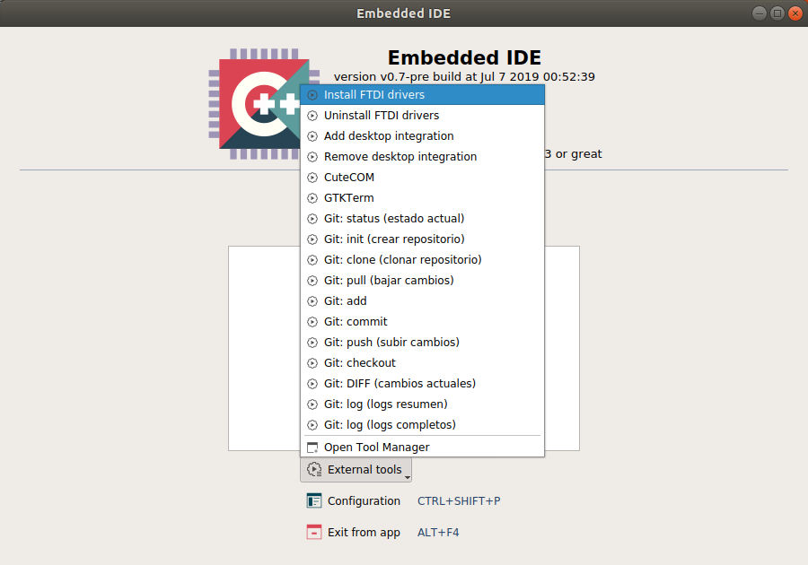

# Paquete de herramientas listas para usar para la programación de las plataformas del Proyeto CIAA

## Herramientas contenidas

- Lanzador de aplicaciones.
- Entornos de programación en lenguaje C/C++:
     - [Embedded IDE.](embedded-ide/README.md)
     - [GNU MCU Eclipse.](eclipse/README.md)
 - [IDE4PLC](ide4plc/README.md). Entorno de programación en lenguaje Ladder Diagram (IEC 61131-3).
 - [CIAABOT IDE](ciaabot-ide/README.md). Entorno de programcación en lenguaje CIAABOT (basado en Blockly).
 - GNU ARM Embedded. Toolchain.
 - OpenOCD. Programación y depuración.
 - Zenity. Generación de interfaces gráficas.

### Herramientas adicionales en la versión de Windows

 - Terminal bpp, versióon 1.93b 20141030. Terminal serie.
 - Busybox.

### Herramientas adicionales en la versión de Linux

 - GTKterm.
 - Cutecom.
 - Git.

## Utilización

Debe descargar de [releases](https://github.com/epernia/software/releases/tag/r1.0.0) la versión para Windows o Linux.

**NOTA: No tiene sentido clonar este repositorio porque solamente incluye documentación, el software está incluído en las releases.**

Descomprimir la carpeta en una ruta conocida, sin espacios y con los permisos adecuados. Se recomiendan:

- **Windows**. C:\CIAA\
- **Linux**. $HOME/CIAA/

Luego ingresar a la carpeta y ejecutar el lanzador de apliaciones. 

**Nota:** Este lanzador *es necesario* debido a que se ejecutan los programas directamente sin utilizarlo les faltará a los mismos rutas necesarias en variable de entorno PATH.

**Lanzador de aplicaciones en Windows**

Desde el lanzador puede ejecutar cualquiera de los programas desde los accesos:

**Primera vez en Windows**

La primera vez debe instalar los **drivers FTDI VCP** (desde el icono del lanzador de aplicacciones) para la EDU-CIAA-NXP o CIAA-NXP:

Presione "Extract" y luego instale el driver con todas las opciones por defecto.

Luego reemplazar el driver del dispositivo *Dual RS232HS (Interface 0)* con **Zadig**. Para lograrlo debe abrir zadig desde el lanzador de aplicaciones y luego en el menú "Optinos" presionar sobre "List all devices". En el combo seleccione el dispositivo "Dual RS232HS (Interface 0)" y presionar el botón "Replace Driver":

**Lanzador de aplicaciones en Linux**

Desde el lanzador puede ejecutar cualquiera de los programas desde los accesos:

**Primera vez en Linux**

La primera vez debe instalar varias herramientas y programas necesarios mediante el icono **Install tools** del lanzador de aplicacciones (se requiere contraseña de administrador para este paso).

Luego debe instalar el **driver FTDI** para la EDU-CIAA-NXP o CIAA-NXP. Esto se logra abriendo **Embedded IDE** desde el lanzador de aplicaciones y presionando el botón "External tools" y luego "Install FTDI drivers":

## Repositorios de Firmware de C/C++

Se recomienda la utilización del último repositorio. Actualmente Firmware v3. Los disponibles son:

- [firmware_v3.](https://github.com/ciaa/firmware_v3)
- [firmware_v2.](https://github.com/ciaa/firmware_v2)
- [firmware_v1.](https://github.com/ciaa/firmware_v1)

## Configurar Eclipse

[Configuración inicial de Eclipse para trabajar con el proyecto Firmware v3.](eclipse/docs/configurar_eclipse.md).
