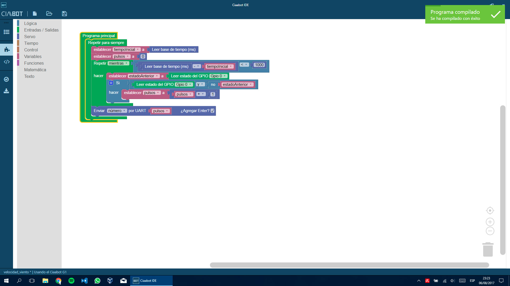

# CIAABOT IDE

El Entorno de Desarrollo para el proyecto CIAABOT.

## Licencia

```
Copyright 2017 Leandro Lanzieri Rodríguez.

This program is free software: you can redistribute it and/or modify
it under the terms of the GNU General Public License as published by
the Free Software Foundation, either version 3 of the License, or
(at your option) any later version.

This program is distributed in the hope that it will be useful,
but WITHOUT ANY WARRANTY; without even the implied warranty of
MERCHANTABILITY or FITNESS FOR A PARTICULAR PURPOSE. See the
GNU General Public License for more details.

You should have received a copy of the GNU General Public License
along with this program. If not, see http://www.gnu.org/licenses/.

For more information see the LICENSE file.
Información del proyecto
```

- Sitio web: http://leandrolanzieri.github.io/ciaabot-ide/

## Sobre el autor

Ing. Leandro Lanzieri Rodríguez (lanzierileandro@gmail.com). Avellaneda, Buenos Aires, Argentina.

Becario del Laboratorio Abierto de la Universidad Tecnológica Nacional - Facultad Regional Avellaneda

## Colaborador

Esp. Ing. Eric Nicolás Pernia (ericpernia@gmail.com). Quilmes, Buenos Aires, Argentina.

Profesor-Investigador en la Universidad Nacional de Quilmes (UNQ).

Coordinador general y Responsable de Software-PLC en el Proyecto CIAA.

## Notas de la versión actual: 0.0.7-r



  - Fecha de lanzamiento: 2017-08-06

### Mapeo de periféricos CIAABOT en EDU-CIAA-NXP:

[Mapeo de periféricos CIAABOT en EDU-CIAA-NXP](docs/CIAABOT mapeo de perifericos EDU-CIAA-NXP.pdf)

### Esta versión incluye los siguientes bloques:

Control de ejecución

  - Si <condicion booleana> hacer [ ]
  - Si no hacer [ ]
  - Si <var> es igual a <literal> hacer [ ] si es distinto a los anteriores hacer [ ]

Bucles de repetición

  - Hacer [ ] y repetir <mientras/hasta> <condicion booleana>
  - Repetir [ ] <mientras/hasta> <condicion booleana>
  - Iterar <var int> desde <literal int> hasta <literal int> incrementando <literal int> y hacer [ ]
  -  Repetir [ ] <literal int> veces
  - Repetir para siempre [ ]

Manejo de tiempo

  - Leer base de tiempo (ms)
  - Escribir base de tiempo (ms)
  - Esperar durante <int> <unidad>

GPIO

  - Leer estado del GPIO <GPIOi, TECi, LEDi>
  - Establecer estado del GPIO <GPIOi , LEDi> en <encender/apagar>
  - Invertir el estado del pin <GPIOi, LEDi>

ADC

  - Leer ADC <ADCi>

DAC

  - Establecer DAC <DACi> al valor <literal int>

UART

  - Recibir byte desde UART <UARTi>
  - Enviar byte <var/literal> por UART <UARTi>
  - Enviar texto <Texto> por UART <UARTi>

PWM

  - Establecer ciclo de trabajo de PWM <PWMi> en <literal int> %

Servo

  - Establecer ángulo de SERVO a <literal int> °
  - Leer ángulo de SERVO <SERVOi>

Utilidades

  - Llevar valor <literal int> desde el rango <literal int> - <literal int> hacia el rango <literal int> - <literal int>

Operadores

  - No []
  - [] < []
  - [] > []
  - [] = []
  - [] ≠ []
  - [] ≤ []
  - [] ≥ []
  - [] y []
  - [] o []
  - [] + []
  - [] - []
  - [] x []
  - [] ÷ []
